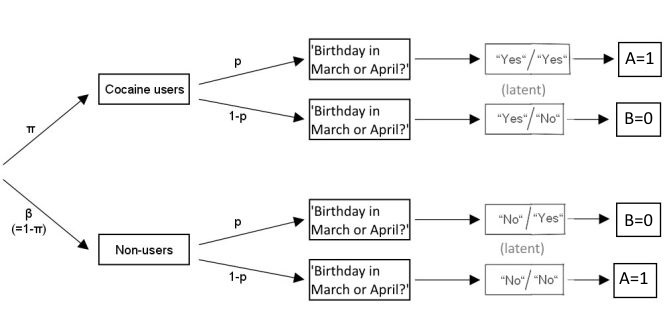

Contact: <daniel.heck@uni-marburg.de>


# Introduction

The randomized response (RR) design was developed by Warner (1965) to allow for complete anonymity of the respondents in surveys and thus to reduce effects of social desirability. In general, some kind of random noise (e.g., throwing a pair of dices) is added to the true response. Whereas the prevalence of a sensitive attribute (by convention termed $\pi$) can still be estimated at the group level, an individual response does not disclose the true state of the respondent. Accordingly, RR data require adapted models and formulas for multivariate analysis, implemented in the package `RRreg`.

The main functions provide the following functionality and are explained in more detail in Section 2:

* [RRuni](#RRuni): simple univariate analysis, i.e., prevalence estimates
* [RRcor](#RRcor): bivariate correlations including RR variables
* [RRlog](#RRlog): logistic regression with an RR variable as criterion
* [RRmixed](#RRmixed): logistic RR regression including random effects (nested or hierarchical data)
* [RRlin](#RRlin): linear regression with a continuous, non-RR criterion including RR variables as predictors

Additionally, three functions can be used to generate data for robustness studies, power analysis, bootstrap estimates, and other testing purposes:

* [RRgen](#RRgen): generates a single data frame including true states, RR responses, and group memberships
* [RRsimu](#RRsimu): Monte Carlo simulation to test `RRuni`,`RRcor`, `RRlog`, and `RRlin` either for one RR and one continuous non-RR variable or for two RR variables (only `RRcor`)
* [powerplot](#powerplot): Monte Carlo simulation to plot the power of the methods `RRuni`,`RRcor`, `RRlog`, or `RRlin` either for one RR and one continuous non-RR variable


In the following, cocaine abuse is used as a running example to demonstrate the RR analysis with `RRreg`. The following RR designs are included in the package: [UQTknown](#UQTknown), [Mangat](#Mangat), [Kuk](#Kuk), [FR](#FR), [Crosswise](#Crosswise), [Triangular](#Triangular), [UQTunknown](#UQTunknown), [CDM](#CDM), [CDMsym](#CDMsym), [SLD](#SLD)

&nbsp; 

# Statistical Methods

<a id="Warner"></a>
<a id="RRuni"></a>

### Univariate Analysis

The original RR design proposed by Warner in 1965 works as follows: With randomization probability `p`, participants are supposed to answer to the question 'Have you ever used cocaine?', and with counter-probability `1-p`, the question is reversed, i.e., 'Have you never used cocaine?'. As a randomization device, dices or coin flips with known probabilities may be used. The model is depicted in the following figure:


<a id="RRgen"></a>
First, let's load the package and generate a single data frame using the function `RRgen`. We simulate data for 1000 participants, a true prevalence of 30% cocaine users (`pi.true = .30`; obviously, this rate is unrealistic, but it should suffice for the sake of example), and a randomization probability of `p=1/6` (e.g., resulting from a dice roll):

```{r}
library(RRreg)
set.seed(123)

data.W <- RRgen(
  n = 1000,
  pi.true = .30,
  model = "Warner",
  p = 1 / 6,
  complyRates = c(1, 1),
  sysBias = c(0, 0)
)
head(data.W)
```

In the function `RRgen`, the argument `complyRates` gives the proportions of participants who do adhere to the RR instructions for carriers and non-carriers of the sensitive attribute, respectively. The argument `sysBias` gives the probability of *yes* responses in case of non-compliance for carriers and non-carriers, respectively. If `sysBias = c(0, 0)`, noncomplying individuals always respond with self-protective *no* responses (also known as SP-'no' responses). In comparison, `sysBias = c(0, 0.5)` indicates that noncomplying non-carriers answer *yes* or *no* by chance. However, since we generated data assuming perfect compliance, this argument can be neglected. These options can be used to test how robust the results are against non-adherence.

Now that we have a data set, we can estimate the prevalence of cocaine users by means of `RRuni`:

```{r}
warner <- RRuni(
  response = response,
  data = data.W,
  model = "Warner",
  p = 1 / 6,
  MLest = TRUE
)
summary(warner)
```

The `response` variable containing 1 for *yes* and 0 for *no* responses can either be given as a vector or as a column name in the data set `data`. Moreover, the argument `model` specifies the RR design with its randomization probability given by `p` (see Sections 4 and 5 for details about other RR models) . If `MLest = FALSE` is used, the prevalence estimate is derived as a closed-form least-squares estimator, which can assume values outside of the interval [0,1]. However, using `MLest = TRUE` (default), estimates of `pi` are restricted to the interval [0,1].

* Warner, S. L. (1965). Randomized response: A survey technique for eliminating evasive answer bias. *Journal of the American Statistical Association, 60*, 63-69. 

&nbsp; 

### Multivariate Analysis

First, we generate a continuous, non-RR variable. According to our simulation, respondents carrying the sensitive attribute (i.e., cocaine users) have higher scores on this covariate:

```{r}
data.W$cov[data.W$true == 1] <- rnorm(sum(data.W$true == 1), 1)
data.W$cov[data.W$true == 0] <- rnorm(sum(data.W$true == 0))
```

<a id="RRcor"></a>

&nbsp; 


#### RRcor: RR correlations

Now, we can estimate the bivariate (point-biserial) correlation between the dichotomous Warner RR variable and the continuous covariate:

```{r}
RRcor(
  x = data.W$response,
  y = data.W$cov,
  models = c("Warner", "direct"),
  p.list = list(1 / 6),
  bs.n = 0,
  bs.type = c("se.n", "se.p", "pval"),
  nCPU = 1
)
```

The argument `models` defines which variables given by `x` and `y` are treated as RR variables. `x` and `y` can be vectors and/or data frames/matrices having one variable in each column (the order is then given as following: First, columns of `x` from left to right, and second, columns of `y` from left to right). The randomization probabilities `p.list` have to be in the same order as `models`. No values have to be specified for direct (nonRR) variables. To obtain bootstrapped standard errors, `bs.n` has to be set to a number of bootstrap replications larger than 0. Additionally, `bs.type` defines which kind of bootstrap should be performed (`"se.n"`, `"se.p"`: nonparametric/parametric for standard errors; `"pval"` parametric bootstrap assuming independence for p-values). For faster processing, `nCPU`can be increased to use parallel computation. In our example, we also know the true states of the participants in the data set and can check the results by:

```{r}
cor(x = data.W$true, y = data.W$cov)
```

* Fox, J. A., & Tracy, P. E. (1984). Measuring associations with randomized response. *Social Science Research, 13*, 188-197. 

&nbsp; 

<a id="RRlog"></a>

#### RRlog: Logistic RR Regression

Alternatively, we can run a logistic regression to predict the probability of cocaine use. In the `formula` below, the Warner RR variable is defined as criterion on the left side, whereas the continuous covariate is used as predictor on the right. The interface is similar to that of the standard linear regression in R (i.e., `lm()`).

```{r}
log1 <- RRlog(
  formula = response ~ cov,
  data = data.W,
  model = "Warner",
  p = 1 / 6,
  fit.n = 1
)
summary(log1)
```

To remove the intercept from the model, use `formula=response~cov - 1`. The argument `LR.test` determines whether the coefficients should be tested by means of a likelihood ratio test, that is, by removing one predictor at a time. Again, we can check the results by:

```{r}
glm(
  formula = true ~ cov,
  data = data.W,
  family = binomial(link = "logit")
)
```

* van den Hout, A., van der Heijden, P. G., & Gilchrist, R. (2007). The logistic regression model with response variables subject to randomized response. *Computational Statistics & Data Analysis, 51*, 6060-6069.

&nbsp; 

<a id="RRmixed"></a>


#### RRmixed: Logistic RR Regression with Mixed Effects

If the data are nested (e.g., students within schools), the logistic regression can be extended to include random effects. In R, the package `lme4` allows for flexible generalized linear mixed models (GLMMs) which include RR logistic regression as a special case. The function `RRmixed` uses the function `glmer`of `lme4` and an adjusted link function. However, at the moment this can only be used with one-group RR models that assume the same link function for all responses.

Some typical examples how to specify models fia the `formula` are:

* random effects: `rrt ~ covariate + (1 | cluster)`
* random slopes: `rrt ~ covariate + (0+covariate | cluster)`
* both: `rrt ~ covariate +(covariate | cluster)`
* level-2 predictors: `rrt ~ covariate + lev2pred + (1 | cluster)` (the predictor lev2pred must have constant values within clusters)

The function `RRmixed` is used as follows:

```{r}
# make random cluster:
data.W$cluster <- c("a", "b")
mixmod <- RRmixed(
  formula = response ~ cov + (1 | cluster),
  data = data.W,
  model = "Warner",
  p = 1 / 6
)
mixmod
```

* van den Hout, A., van der Heijden, P. G., & Gilchrist, R. (2007). The Logistic Regression Model with Response Variables Subject to Randomized Response. *Computational Statistics & Data Analysis*, 51, 6060–6069.

&nbsp; 

<a id="RRlin"></a>

#### RRlin: RR Predictors in a Linear Regression

Third, we can use the Warner RR variable as predictor in a linear regression:

```{r}
lin1 <- RRlin(
  formula = cov ~ response,
  data = data.W,
  models = "Warner",
  p.list = 1 / 6,
  bs.n = 0,
  fit.n = 1
)
summary(lin1)
```

As in `RRcor`, bootstrapped standard errors can be obtained by setting `bs.n` to the number of bootstrap replications. The order of the RR models is defined by `models` and `p.list`. For instance, given three RR variables `rr1`, `rr2`, and `rr3` and two non-RR/direct variables `x1` and `x2`, the model could be specified by `formula = y ~ rr1 + x1 + rr2 + rr3 + x2` and `models=c('Warner', 'direct', 'Warner', 'Warner', 'direct')`. Note that the predictors in `formula` can either be vectors or column names of variables in the data frame `data`.

As a special case, if the number of predictors used in the formula interface is larger than the number of RR variables specified in `models`, the remaining predictors are treated as directly measured, non-RR variables:

```{r}
data.W$pred <- rnorm(1000)
lin2 <- RRlin(
  formula = cov ~ response + pred,
  data = data.W,
  models = "Warner",
  p.list = list(1 / 6),
  bs.n = 0,
  fit.n = 1
)
summary(lin2)
```

To check the results of the simulation, run:

```{r}
lm(cov ~ true + pred, data = data.W)
```

It is also possible to include several RR variables as predictors if the randomization devices used are stochastically independent: 

```{r, echo = TRUE}
data.W2 <- RRgen(n = 1000, pi.true = .45, model = "Warner", p = .35)
data.W$cov <-
  2 * as.numeric(data.W$true) -
  3 * as.numeric(data.W2$true) +
  rnorm(1000, mean = 1, sd = 5)
data.W$response2 <- data.W2$response

lin3 <- RRlin(
  formula = cov ~ response + response2,
  data = data.W,
  models = c("Warner", "Warner"),
  p.list = list(1 / 6, .35),
  fit.n = 1
)
summary(lin3)
```


Besides the regression coefficients, `RRlin()` also estimates the prevalences for 
all combinations of RR responses:

```{r}
lin3$pi
```

In our example using two Warner variables, the combination 0:0 indicates the (latent) sub-group having neither of both sensitive attributes and shows the corresponding prevalence estimate. Similarly, the combination 0:1 indicates the sub-group having only the second sensitive attribute and so on. Note that the last combination 1:1 is not provided and can be calculated by summing up all other prevalence estimates and subtracting this sum from 1.

To include many RR variables as predictors, very large sample sizes are required for reliable estimation. In such a case, it might be necessary to adjust the optimization parameters `maxit` (maximum number of iterations) and `pibeta` (relative ratio of probability scale for `pi` to regression coefficients `beta`; e.g., choose a smaller value for larger absolute beta values).

* van den Hout, A., & Kooiman, P. (2006). Estimating the linear regression model with categorical covariates subject to randomized response. *Computational Statistics & Data Analysis, 50*, 3311-3323. 

&nbsp; 


# Testing RR vs. Direct Questioning (DQ)

The method `RRlog` can be used to test whether an RR design leads to higher prevalence estimates than direct questioning (DQ). For one-groups designs (such as the Warner model), define a vector with indices 0 for all participants who were questioned by DQ and indices 1 for participants questioned by the RR design and include this dummy variable as predictor. For two-group designs (see below), define an effect-coded variable contrasting DQ ($=-1$) and RR ($=+1$), and define a vector with indices 0 for participants questioned by DQ and indices 1 and 2 denoting the group of the RR design.

If the regression coefficient of the effect-coded predictor is significant, this indicates different prevalence rates between RR and DQ.

Furthermore, interactions between question format (RR vs. DQ) and other predictors can be tested. For instance, one might want to know whether the regression coefficient of a predictor (e.g., age) differs between question formats (e.g., whether the RR format serves as a more valid criterion). Interactions are included by `formula= RR ~ format + age + format:age`. 

An example is:

```{r}
# generate data with different prevalence rates for RR and DQ
RR <- RRgen(n = 500, pi = .5, model = "Warner", p = 2 / 12)
DQ <- rbinom(500, size = 1, prob = .35)
response <- c(RR$response, DQ)
# dummy variable for RR vs. DQ
group <- rep(1:0, each = 500)
# predictor variable (effect-coded)
RR.design <- rep(c(1, -1), each = 500)
# simulate interaction of question format and age
# (DQ: no correlation; RR: positive correlation)
z.age <- scale(c(
  rnorm(500, mean = RR$true, sd = 3),
  rnorm(500, mean = .5, sd = 3)
))
# fit full model
# (testing difference in prevalence estimates and interaction)
fit <- RRlog(
  formula = response ~ RR.design * z.age,
  model = "Warner",
  p = 2 / 12,
  group = group,
  LR.test = TRUE,
  fit.n = 1
)
summary(fit)
# get prevalence estimate for RR and DQ
# (for z.age = 0 = mean(z.age))
logit1 <- coef(fit) %*% c(1, 1, 0, 1 * 0)
cat(exp(logit1) / (1 + exp(logit1)))
logit2 <- coef(fit) %*% c(1, -1, 0, -1 * 0)
cat(exp(logit2) / (1 + exp(logit2)))

# Likelihood ratio test again model with main effect only
fit2 <- RRlog(
  formula = response ~ RR.design,
  model = "Warner",
  p = 2 / 12,
  group = group,
  LR.test = TRUE,
  fit.n = 1
)
anova(fit, fit2)
```

&nbsp; 

# Specification of RR Models Using One Group

In the following, several other available RR models are listed, which can be used throughout the package functions. For each model, the randomization probability `p` must be given as defined below.

&nbsp; 

<a id="UQTknown"></a>

#### Unrelated Question Techique with Known Prevalance (UQTknown)

`model = 'UQTknown'`

In this RR design, participants either respond to the sensitive question or to a second irrelevant question. Importantly, the interviewer is unaware which question was answered. The randomization probability `p[1]` determines the proportion of participants that is directed to answer the sensitive question, whereas the remaining participants answer the irrelevant question. In the UQTknown design, the prevalence rate of *yes* responses for this irrelevant question must be known beforehand (e.g., "Is your birthday in April?", `p[2]=1/12`) and provided together with the randomization probability by the vector `p=c(p[1], p[2])` (see [UQTunknown](#UQTunknown) if the prevalence is unknown). 


* Scheers, N. J. (1992). A review of randomized response techniques. *Measurement and Evaluation in Counseling and Development, 25*, 27-41. 

&nbsp; 

<a id="Mangat"></a>

#### Mangat's RR Design

`model = 'Mangat'`

In Mangat's model, carriers of the critical attribute are always provided with the sensitive statement. In contrast, non-carriers of the critical attribute are to respond to the sensitive statement with probability `p` and to its negation otherwise.


* Mangat, N. (1994). An improved randomized-response strategy. *Journal of the Royal Statistical Society, Series B, 56*, 93-95. 

&nbsp; 

<a id="Kuk"></a>

#### Kuk's RR Design

`model = 'Kuk'`

Kuk's method uses two decks of playing cards to ensure anonymity of the respondents. Whereas carriers of the sensitive attribute are told to report the color of a card drawn from the *first* deck, non-carriers should report the color of a card from the *second* deck. Importantly, the interviewer does not know, from which deck a card was drawn.

Each deck contains red and black cards, coded with 1 and 0, respectively. However, the proportion of red cards differs in the two decks, defined by the vector `p=c(p[1], p[2])` (i.e., proportion of red cards for carriers and non-carriers of the sensitive attribute, respectively).

Note that the procedure can be applied repeatedly to obtain more reliable estimates (with replacement of the drawn cards). For instance, with 5 repetitions, the observed RR variable can assume values from 0 to 5, i.e., the reported number of red cards. The functions `RRgen` (data generation), `RRuni` (univariate analysis), and `RRlin` (linear regression with RR predictors) can accomodate this extended design, using the additional argument `Kukrep`. However, at the moment, this option is not available in `RRcor` and `RRlog`.


* Kuk, A. Y. (1990). Asking sensitive questions indirectly. *Biometrika, 77*, 436-438. 

&nbsp;

<a id="FR"></a>

#### Forced Response (FR)

`model = 'FR'`

In the forced response (FR) model (also known as directed-answers model), a known proportion of the participants is prompted to respond *yes*, whereas another proportion is prompted to respond *no*, independent of their true status. Only the remaining participants answer truthfully. The randomization probability `p` is now a vector, containing two values, i.e., being prompted to respond *no* and *yes*, respectively. The model is shown in the following figure:


The FR model can easily be extended to account for more than two response categories. For instance, responses can be given on a 5-point Likert scale from 0 to 4. For these categories, the randomization probabilities, determining the proportion of forced responses, are provided in a vector `p = c(p[1], p[2],...,p[5])`. The sum of these probabilities must be smaller than one. This polytomous RR model can be used with the functions `RRgen`, `RRuni`, `RRcor`, and `RRlin` (the logistic RR regression `RRlog` requires a dichotomous response format).

The following code snippets illustrate, how the FR method is used with multiple response categories:

```{r}
RR <- RRgen(
  n = 1000,
  pi.true = c(.1, .2, .1, .4, .2),
  model = "FR", p = c(.1, .1, .05, .05, .05)
)
dat <- data.frame(
  response = RR$response,
  dv = RR$true + rnorm(1000)
)

fit <- RRlin(dv ~ response,
  data = dat,
  models = "FR",
  p.list = list(c(.1, .1, .05, .05, .05)),
  fit.n = 1
)
summary(fit)
```

For data generation of a polytomous FR model using `RRgen`, the arguments `complyRates` and `sysBias` have the following definition:

* `complyRates=c(c0, c1, ...)` gives the probability of complying to the RR instructions separately for all possible true states
* `sysBias = c(s1, s2, ...)` defines the multinomial probability distribution which is used in case of noncompliance (the values have to sum up to 1). 

For instance, having the categories `0, 1, 2, 3, 4` and `complyRates=c(1, 1, 1, .8, .5), sysBias=c(.5, .3, .2, 0, 0)` would simulate the scenario that participants with true states 3 and 4 would comply less and instead prefer responses 0, 1, or 2.

* Greenberg, B. G., Abul-Ela, A.-L. A., Simmons, W. R., & Horvitz, D. G. (1969). The Unrelated Question Randomized Response Model: Theoretical Framework. *Journal of the American Statistical Association, 64*, 520-539.

&nbsp;

<a id="Crosswise"></a>

#### Crosswise Model

`model = 'Crosswise'`

Concerning the model equations, the Crosswise model is technically identical to the Warner model. However, instead of answering to the sensitive question directly, respondents are instructed to respond to the sensitive and an irrelevant question simultaneously, according to the following scheme:

* If your answer is *yes* to both questions or *no* to both questions, choose Option A (coded as 1)
* If your answer is *yes* to one and *no* to the other question, choose Option B (coded as 0)



For the irrelevant question, the prevalence of *yes* responses  has to be known beforehand and is specified in RRreg by `p` (e.g., for the irrelevant question 'Is Your birthday in March or April?', `p = 2/12`). 

* Yu, J.-W., Tian, G.-L., & Tang, M.-L. (2008). Two new models for survey sampling with sensitive characteristic: Design and analysis. *Metrika, 67*, 251-263. 

&nbsp;

<a id="Triangular"></a>

#### Triangular Model

`model = 'Triangular'`

The Triangular model is technically similar to the Mangat's RR model. However, instead of answering to the sensitive question directly, respondents are instructed to respond to the sensitive and an irrelevant question simultaneously, according to the following scheme:

* If your answer is *no* to both questions, respond with Option A (coded as 0, the `circle' in Yu et al., 2008)
* If your answer is *yes* to at least one of the two questions, respond with Option B (coded as 1; the `triangle' in Yu et al., 2008)

For the irrelevant question, the prevalence of *yes* responses  has to be known beforehand and is specified in RRreg by `p` (e.g., for the irrelevant question 'Is Your birthday in March or April?', `p = 2/12`). 

* Yu, J.-W., Tian, G.-L., & Tang, M.-L. (2008). Two new models for survey sampling with sensitive characteristic: Design and analysis. *Metrika, 67*, 251-263. 

&nbsp;

<a id="custom"></a>

#### RR as Misclassification

`model = 'custom'`

RR designs can be understood as a misclassification mechanisms: The true latent states/responses are perturbed randomly according to a known randomization scheme. This randomization scheme can be described in form of a matrix $PW$, where each entry $PW_{ji}$ gives the probability to give a response $j$ if the true state is $i$.

The package `RRreg` contains the function `getPW` to obtain this misclassification matrix for the implemented designs. The forced response design with probabilities `P = c(.1, .2)`, for instance, can be described by:

```{r}
getPW(model = "FR", p = c(.1, .1))
```

To specify a custom misclassification matrix, the arguments `model = "custom"` and a randomization matrix `p=matrix(p00, p10, p01, p11), ncol=2, nrow=2)` are required. The approach generalizes to categorical, non-binary data by specifying an $m \times M$ matrix. Note that for two-group designs, the matrix $PW$ depends on the groupd and on a second parameter, which needs to be estimated from the data (e.g., the unknown prevalence in `"UQTunknown"`). 

* van den Hout, A., & Kooiman, P. (2006). Estimating the Linear Regression Model with Categorical Covariates Subject to Randomized Response. *Computational Statistics & Data Analysis*, 50(11), 3311–3323.

&nbsp;

<a id="two-group"></a>


# Specification of RR Models Using Two Groups

For several reasons, RR designs were proposed that require two independent random samples (groups). Historically, the second group was used to estimate the prevalence of the irrelevant question in the UQT. Alternatively, two groups allow for a second parameter, quantifying cheating or compliance with the RR procedure. 

For these two-group models, the functions `RRuni`, `RRcor`, `RRlog`, and `RRlin` additionally require a vector `group` with values in 1 and 2, indicating the group membership of each respondent. If more than one RR variable is in the model, `group` is specified by a matrix containing the corresponding group vectors (one in each column) in the same order as the RR variables appear in the model. Moreover, the randomization probability `p` often specifies different values for the two groups. Code examples are given in [Section 5.5](#two-group-code-example).

Note that in the functions `RRcor` and `RRlin`, the second parameter of these two-group models is estimated first and then treated as a fixed constant in further computations. For the maximum likelihood estimation in `RRlin`, the second parameter should ideally be included as an additional, free parameter to provide unbiased standard errors (this is the case for the function `RRlog`). However, simulations show that the results are still adequate. `RRsimu` can be used to run such a simulations yourself and get bootstrapped standard errors.

&nbsp;

<a id="UQTunknown"></a>

#### Unrelated Question Technique with Unknown Prevalance (UQTunknown)

`model = 'UQTunknown'`

In this extension of the [UQTknown](#UQTknown) RR design, the prevalence of the second, irrelevant question is unknown beforehand and estimated from the data. Note that this second question has to be stochastically independent of the sensitive attribute.

The randomization probability `p` is defined as 

* `p[1]` - probability to respond to the sensitive question in group 1
* `p[2]` - probability to respond to the sensitive question in group 2

The randomization probabilities must differ across groups to render the model identifiable (i.e., `p[1]!=p[2]`). When generating data by means of `RRgen`, the prevalence rates of *yes* responses can be specified by `pi=c(pi.sensitive, pi.irrelevant)`. If only a single value is provided, the prevalence rate for the irrelevant question is randomly drawn from a uniform distribution.

Note that Moor's variant of the UQT with unknown prevalence can be used by setting `p[2]=0`. Thereby, the second group is only used to estimate the prevalence of responding *yes* to the irrelevant question.


* Greenberg, B. G., Abul-Ela, A.-L. A., Simmons, W. R., & Horvitz, D. G. (1969). The Unrelated Question Randomized Response Model: Theoretical Framework. *Journal of the American Statistical Association, 64*, 520-539.

* Moors, J. J. A. (1971). Optimization of the Unrelated Question Randomized Response Model. *Journal of the American Statistical Association, 66*, 627-629.

&nbsp;

<a id="CDM"></a>

#### Cheating Detection Model (CDM)

`model = 'CDM'`

The CDM is based on the forced-response design and prompts a proportion `p` of participants to respond *yes* regardless of their true state. In contrast to the FR design, the cheating detection model (CDM) divides the population into three distinct groups: Compliant carriers of the sensitive attribute (`pi`), compliant noncarriers (`beta`), and cheating respondents who always respond *no* (`gamma`). This last group of cheaters is not further divided into carriers and noncarriers of the sensitive attribute. To estimate the two parameters `pi` and `gamma`, the sample is randomly divided into two parts using different randomization probabilities defined as:

* `p[1]` - probability to be prompted to say *yes* in group 1
* `p[2]` - probability to be prompted to say *yes* in group 2

The randomization probabilities must differ across groups to render the model identifiable (i.e., `p[1]!=p[2]`).

Because of the assumption of three distinct groups, the CDM is not available in the functions `RRcor` and `RRlin`. However, the function `RRlog` performs a logistic regression to predict the probability of being in the first group (i.e., having the sensitive attribute and complying with the RR procedure). Note that conclusions are restricted to this group, only.


* Clark, S. J., & Desharnais, R. A. (1998). Honest answers to embarrassing questions: Detecting cheating in the randomized response model. *Psychological Methods, 3*, 160-168.

&nbsp;

<a id="CDMsym"></a>

#### Symmetric CDM (CDMsym)

`model = 'CDMsym'`

In contrast to the standard cheating detection model (CDM) discussed in Section 5.2, in the *symmetric* CDM (CDMsym), some respondents are also prompted to respond *no* with a given probability, not only *yes*. Thereby, anonymity and compliance can be increased (Ostapczuk & al., 2009), because participants directly see that both, *yes* and *no* responses are uninformative in respect to the sensitive attribute. Similarly as with the CDM, using CDMsym in `RRlog` predicts the joint probability of having the sensitive attribute and complying with the RR procedure. `CDMsym` cannot be used in the functions `RRcor`and `RRlin`.

The randomization probability `p` is a vector with 4 values:

* `p[1]` - probability to be prompted to say *yes* in group 1 
* `p[2]` - probability to be prompted to say *no* in group 1 
* `p[3]` - probability to be prompted to say *yes* in group 2 
* `p[4]` - probability to be prompted to say *no* in group 2 

The randomization probabilities must meet these restrictions:

* different probabilities across groups (`p[1]!=p[3]`and `p[2]!=p[4]`)
* within each group, the sum of both probabilities is below one (`p[1]+p[2]<1` and `p[3]+p[4]<1`)


* Ostapczuk, M., Moshagen, M., Zhao, Z., & Musch, J. (2009). Assessing sensitive attributes using the randomized response technique: evidence for the importance of response symmetry. *Journal of Educational and Behavioral Statistics, 34*, 267-287. 

&nbsp;

<a id="SLD"></a>

#### Stochastic Lie Detector (SLD)

`model = 'SLD'`

The stochastic lie detector (SLD) is based on Mangat's model (Section 4.2) and adds a second parameter `t`, which gives the probability of honest responding within the group carrying the sensitive attribute. Note that in contrast to the CDM, the probability of having the sensitive attribute `pi` is corrected for cheating. 

The randomization probability `p` is a vector with 2 values:

* `p[1]` - probability for noncarriers to reply with *no* in group 1 
* `p[2]` - probability for noncarriers to reply with *no* in group 2 

The randomization probabilities must differ across groups to render the model identifiable (i.e., `p[1]!=p[2]`).


* Moshagen, M., Musch, J., & Erdfelder, E. (2012). A stochastic lie detector. *Behavior Research Methods, 44*, 222-231. 
 
&nbsp;


<a id="two-group-code-example"></a>
 
#### Code Examples for Two-Group Models

```{r}
### generate 2 two-group RR variables and a continuous covariate
RR1 <- RRgen(n = 1000, pi = .4, model = "SLD", p = c(.2, .8), complyRates = c(.8, 1))
RR2 <- RRgen(n = 1000, pi = .6, model = "SLD", p = c(.3, .7), complyRates = c(.9, 1))
df <- data.frame(
  rr1 = RR1$response,
  rr2 = RR2$response,
  cov = RR1$true + RR2$true + rnorm(1000, 0, 3)
)

### logistic regression (dependent RR variable)
logmod <- RRlog(rr1 ~ cov,
  data = df,
  model = "SLD",
  p = c(.2, .8),
  group = RR1$group,
  fit.n = 1
)
summary(logmod)

### group matrix for RRlin and RRcor: use multiple group vectors in one matrix
group <- cbind(RR1$group, RR2$group)

# bivariate correlation between 2 two-group variables and a continuous covariate
# note that only the most informative subsets of the data are used (see ?RRcor)
RRcor(
  x = df,
  models = c("SLD", "SLD", "direct"),
  p.list = list(c(.2, .8), c(.3, .7)),
  group = group
)

# linear model with 2 RR predictors
linmod <- RRlin(cov ~ rr1 + rr2,
  data = df,
  models = c("SLD", "SLD"),
  p.list = list(c(.2, .8), c(.3, .7)),
  group = group,
  fit.n = 1
)
summary(linmod)
```
